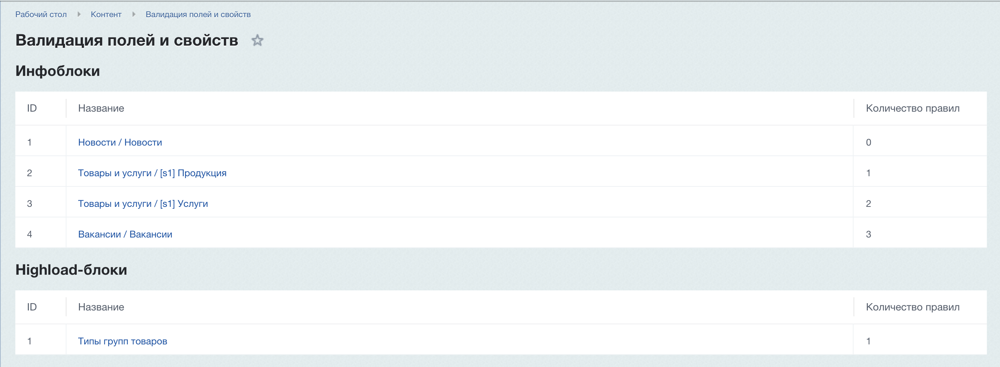
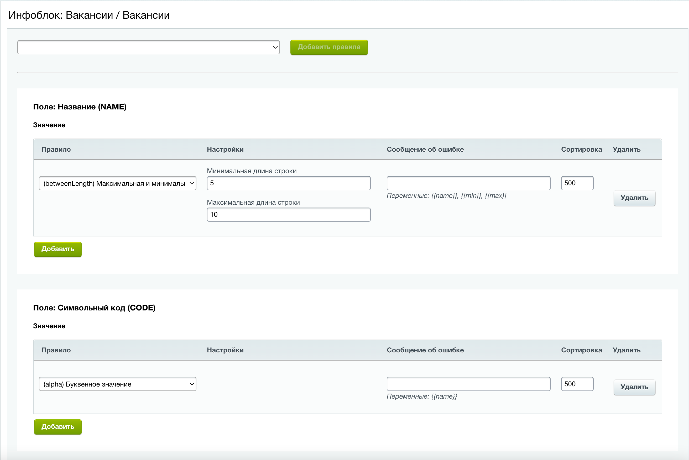
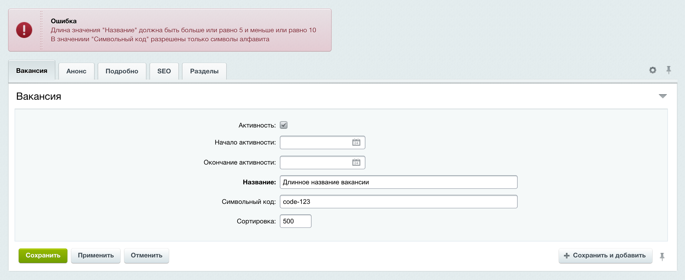

# Модуль 1С-Битрикс "Проверка значений (валидация) полей и свойств инфоблоков и highloadblock'ов"

[![Latest Version][badge-release]][packagist]
[![Software License][badge-license]][license]
[![PHP Version][badge-php]][php]
[![Total Downloads][badge-downloads]][downloads]

Осуществляет настройку и валидацию полей и свойств инфоблоков и highloadblock'ов в 1С-Битрикс.
Предоставляет удобный интерфейс для определения правил валидации для полей и свойств.
Модуль использует для проверки (валидации) библиотеку [fi1a/validation](https://github.com/fi1a/validation).

## Установка модуля через composer

В вашем composer.json проекта необходимо указать:

- в блоке require указать инсталятор ```"fi1a/installers": "~1.0"```;
- в блоке require указать модуль ```"fi1a/bitrixvalidation": "~1.0"```;
- указать путь до 1С-Битрикс (`bitrix-dir`) для копирования модулей при установке ```fi1a/installers```.

Пример файла composer.json проекта:

```json
{
  "name": "fi1a/project",
  "type": "project",
  "license": "MIT",
  "authors": [
    {
      "name": "Fi1a",
      "email": "fi1a@icloud.com"
    }
  ],
  "require": {
    "fi1a/installers": "~1.0",
    "fi1a/bitrixvalidation": "~1.0"
  },
  "extra": {
    "bitrix-dir": "../bitrix"
  }
}
```

Затем выполняем установку пакетов командой ```composer install```.

Если у вас не подключен composer autoload.php, его необходимо подключить в файле local/php_interface/init.php

```php
require_once __DIR__ . '/../vendor/autoload.php';
```

Если модуль не установили через composer, его необходимо установить из админки 1С-Битрикс
(Marketplace > Установленные решения > модуль "Валидация полей и свойств (fi1a.bitrixvalidation)").

**После установки проверьте права на чтение файлов и папок модуля.**

Модуль будет доступен в меню: Контент > Валидация полей и свойств.

## Изображения модуля

Список доступных инфоблоков и highloadblock'ов для задания правил проверки:



Задание правил проверки (валидации) для полей и свойств инфоблока:



Проверка валидация при сохранении инфоблока:



## Доступные правила проверки (валидаторы значений)

- (alphaNumeric) Буквенно-цифровое значение;
- (alpha) Буквенное значение;
- (betweenCount) Минимальное и максимальное количество значений;
- (betweenLength) Максимальная и минимальная длина строки;
- (between) Максимальное и мимальное значение;
- (boolean) Логическое значение;
- (date) Дата и время;
- (email) E-mail адрес;
- (in) Допустимые значения (не строгая проверка);
- (integer) Целое число;
- (json) JSON-строка;
- (maxCount) Максимальное количество значений;
- (maxLength) Максимальная длина строки;
- (max) Максимальное значение;
- (minCount) Минимальное количество значений;
- (minLength) Минимальная длина строки;
- (min) Минимальное значение;
- (notIn) Не допустимые значения (не строгая проверка);
- (numeric) Число;
- (regex) Регулярное выражение;
- (strictIn) Допустимые значения (строгая проверка);
- (strictNotIn) Не допустимые значения (строгая проверка);
- (unique) Уникальное значение.

[badge-release]: https://img.shields.io/packagist/v/fi1a/bitrixvalidation?label=release
[badge-license]: https://img.shields.io/github/license/fi1a/bitrixvalidation?style=flat-square
[badge-php]: https://img.shields.io/packagist/php-v/fi1a/bitrixvalidation?style=flat-square
[badge-downloads]: https://img.shields.io/packagist/dt/fi1a/bitrixvalidation.svg?style=flat-square&colorB=mediumvioletred

[packagist]: https://packagist.org/packages/fi1a/bitrixvalidation
[license]: https://github.com/fi1a/bitrixvalidation/blob/master/LICENSE
[php]: https://php.net
[downloads]: https://packagist.org/packages/fi1a/bitrixvalidation